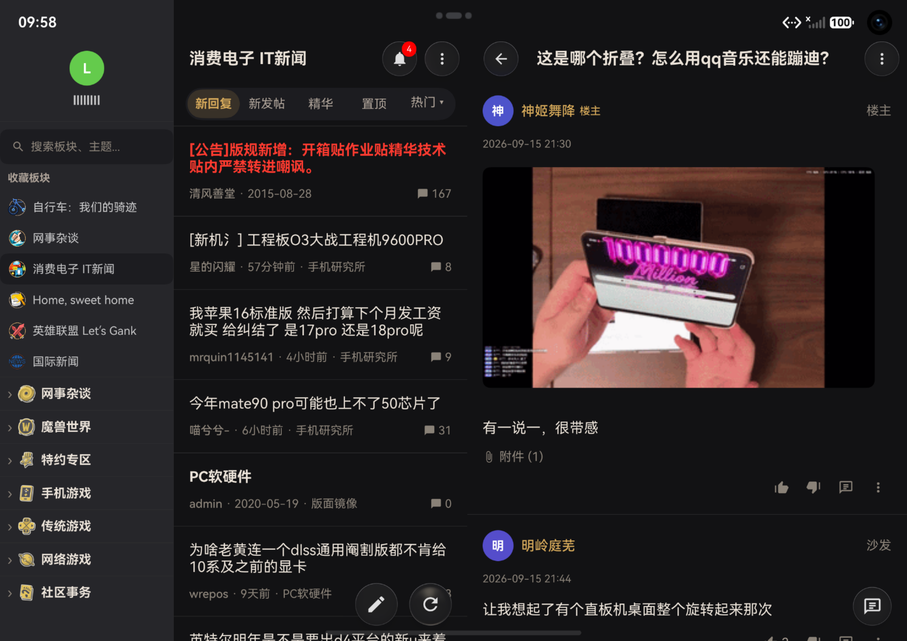
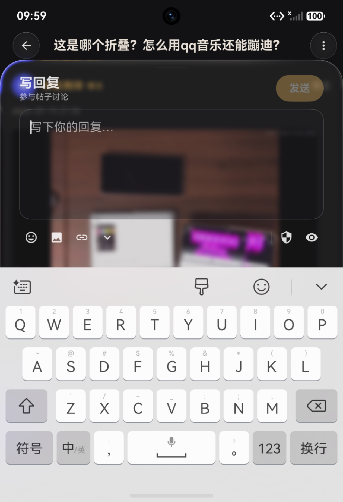
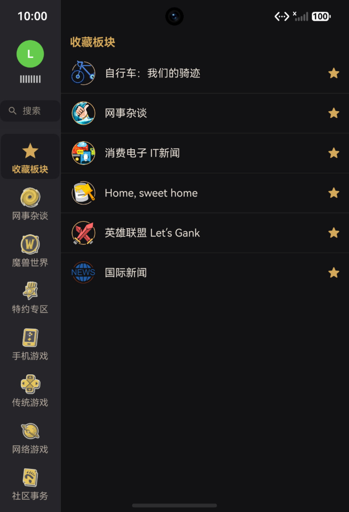

  
  <h1>LNGA</h1>
  
<strong>NGA 玩家社区 · 鸿蒙原生客户端</strong>

  

    
    
    
    
  

---

> ## ⚠️ 安装须知
>
> **HarmonyOS 不能直接安装 .hap 文件包**。你需要使用签名工具对 HAP 进行签名后才能安装到手机上。
>
> 推荐使用 **小白调试助手（Auto-Installer）**：
> - 📖 [使用教程视频（B站）](https://www.bilibili.com/video/BV1K6daBrENN)
> - ⬇️ [下载地址（GitHub Releases）](https://github.com/likuai2010/auto-installer/releases/tag/3.1.0)
>
> 该工具支持 Windows / macOS / Linux，可自动完成签名并安装，无需 DevEco Studio。
>
> 从本仓库 Releases 下载的 HAP 均为**未签名包**，请使用上述工具自行签名后安装。

---

## 简介

**LNGA** 是基于 **HarmonyOS** 原生框架 **ArkUI (ArkTS)** 构建的 [NGA 玩家社区](https://nga.cn) 客户端。致力于在鸿蒙生态中提供流畅、原生的 NGA 论坛浏览与交互体验。

项目完整覆盖了 NGA 论坛的核心功能：板块浏览、帖子阅读、发帖回复、私信聊天、通知推送、AI 内容总结等，并针对手机、平板、二合一设备做了自适应布局适配。

---

## 维护策略

- **`main`（API 26 / HarmonyOS 7.0.0）** — 当前主线，基于 API 26 特性持续开发新功能。
- **`oh23`（API 23 / HarmonyOS 6.1.0）** — 旧版备份分支，**已暂停新功能开发**，仅维护关键错误修复。

> 需要基于 API 23 的稳定版本时，请切换到 `oh23` 分支获取源码，或使用对应的旧版 Releases。

---

## 构建

使用 [DevEco Studio](https://developer.huawei.com/consumer/cn/deveco-studio/)（需支持 HarmonyOS SDK 26 / API 26）打开项目根目录，连接真机或模拟器后点击 `Run` 即可编译运行。

---

## 预览

**阔折叠 · 横屏 (2584×1828)**

**阔折叠 · 竖屏 (1264×1848)**

 &nbsp; 

## 致谢

- [NGA 玩家社区](https://nga.cn) — 国内领先的游戏综合讨论社区
- [Justwen/NGA-CLIENT-VER-OPEN-SOURCE](https://github.com/Justwen/NGA-CLIENT-VER-OPEN-SOURCE) — Android 端开源参考实现

---

## 许可证

GNU General Public License v2.0 — 详见 [LICENSE](LICENSE)

---

  用 ❤️ 和 ArkUI 构建 · 鸿蒙原生体验

